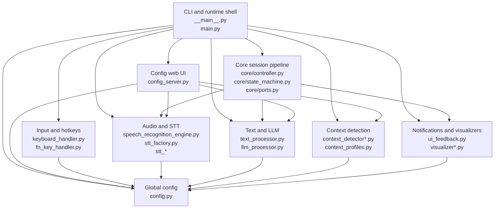
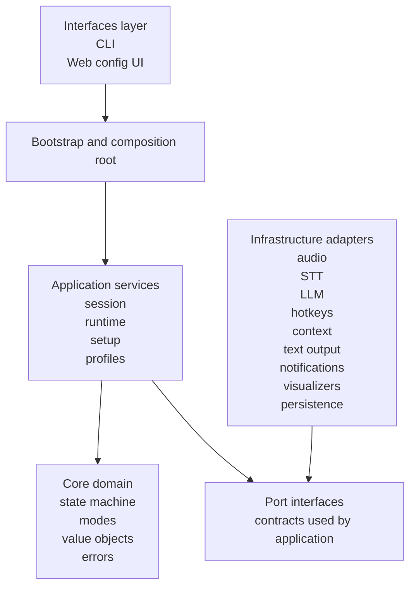

# Dicton Architecture and Refactor Plan

## Purpose

This document does two jobs:

1. Describe the codebase as it exists today, without pretending it is cleaner than it is.
2. Define a refactor plan that moves the repository toward a strict layered architecture with explicit dependency rules.

This is not a rewrite proposal. The repository already has enough working behavior and test coverage that a rewrite would be reckless.

## Executive Judgment

Dicton is currently a **hybrid architecture**:

- The `core/` package is a real partial hexagonal core.
- The rest of the system is still largely organized as an evolved script application.
- A few adapter modules exist, but many are pass-through wrappers around legacy modules.

The result is workable, but structurally unstable. New features can still be added, but they tend to accumulate in oversized modules instead of reinforcing boundaries.

The target architecture should be:

- **Layered**
- **Port-driven at the application boundary**
- **Composition-root based**
- **Explicit about infrastructure ownership**

The target is not “enterprise architecture”. The target is a system where dependencies are obvious, runtime behavior is testable, and the next feature does not automatically make `main.py` or `config_server.py` worse.

## Current Repository Shape

### Current major modules

| Area | Current files | Current role |
|---|---|---|
| CLI entry | `src/dicton/__main__.py`, `src/dicton/main.py` | CLI dispatch, runtime startup, shutdown, commands |
| Session core | `src/dicton/core/controller.py`, `src/dicton/core/state_machine.py`, `src/dicton/core/ports.py` | Record -> transcribe -> process -> output pipeline |
| Config | `src/dicton/config.py`, `src/dicton/adapters/config_env.py`, `src/dicton/core/config_model.py` | Global import-time settings with a thin typed facade |
| Audio/STT | `src/dicton/speech_recognition_engine.py`, `src/dicton/stt_factory.py`, `src/dicton/stt_provider.py`, `src/dicton/stt_mistral.py`, `src/dicton/stt_elevenlabs.py` | Audio capture, provider selection, transcription |
| Input/output | `src/dicton/keyboard_handler.py`, `src/dicton/fn_key_handler.py`, `src/dicton/selection_handler.py` | Hotkeys, text insertion, selection handling |
| Text/LLM | `src/dicton/text_processor.py`, `src/dicton/llm_processor.py`, `src/dicton/processing_mode.py` | Local cleanup, LLM prompting, mode policy |
| Context | `src/dicton/context_detector.py`, `src/dicton/context_detector_x11.py`, `src/dicton/context_detector_wayland.py`, `src/dicton/context_detector_windows.py`, `src/dicton/context_profiles.py` | Active app and widget context detection |
| UI feedback | `src/dicton/ui_feedback.py`, visualizers | Notifications and recording visualization |
| Web config UI | `src/dicton/config_server.py`, `src/dicton/assets/*.html` | Config persistence, setup flow, diagnostics, test recording, web routes |
| Packaging and ops | `packaging/`, `scripts/`, `run.sh`, `run.bat` | Packaging, service setup, installers |

### Current architecture pattern

The codebase currently uses these patterns:

- **Partial hexagonal architecture** in `core/`
- **Factory pattern** for STT provider selection
- **Strategy-style variation** for provider backends and context detectors
- **State machine** for session lifecycle and FN key flow
- **Singleton/global configuration** via `config.py`
- **Composition inside a runtime object** via `Dicton` in `main.py`

The first four are useful. The last two are the main structural liabilities.

## Current Layer Diagram



### Current structural problems

| Problem | Where it shows up | Why it is a real issue |
|---|---|---|
| God object runtime | `src/dicton/main.py` | Startup, runtime policy, UI policy, context capture, recording thread control, processing, output, and shutdown are mixed |
| Import-time global config | `src/dicton/config.py` | Hidden dependencies, hard runtime reload semantics, test setup overhead, accidental coupling |
| Overloaded web module | `src/dicton/config_server.py` | HTTP routes, env persistence, diagnostics, background recording, profile CRUD, HTML serving in one file |
| Overloaded hotkey module | `src/dicton/fn_key_handler.py` | Device discovery, hotplug, state machine, low-level input loop, callback dispatch all in one place |
| Broad exception swallowing | throughout runtime and infrastructure | Failures become ambiguous and debugging becomes empirical instead of deterministic |
| Print-driven diagnostics | throughout runtime and providers | No severity, no event structure, no reliable test assertions on error paths |
| Incomplete boundary extraction | several adapters are thin wrappers over legacy modules | The architecture signals discipline without enforcing it |

## Hard Architectural Constraints

These constraints come from the product, not from architectural taste:

1. Dicton is a desktop system integration app, not a pure library.
2. Linux is the main platform and has the hardest low-level behavior.
3. Audio capture, clipboard, input devices, accessibility, and compositor behavior are all infrastructure concerns.
4. Remote STT and LLM calls dominate latency more than Python compute overhead.
5. The app needs graceful degradation when optional dependencies are missing.
6. Packaging and startup paths must remain simple.

A refactor must preserve those constraints. Any plan that ignores them is architecture theatre.

## Target Architecture

### Target design pattern

The correct target is a **strict layered architecture with hexagonal boundaries around the application services**.

Concretely:

- `core/` contains pure policy and small value objects.
- `application/` orchestrates use cases and depends only on `core/` contracts.
- `infrastructure/` implements device, network, provider, and OS integration.
- `interfaces/` exposes CLI and web entrypoints.
- `bootstrap/` owns object wiring and runtime composition.

This is not a new pattern for the sake of style. It directly addresses the current failure modes:

- hidden configuration coupling
- runtime orchestration packed into one object
- infrastructure leaking into route handlers and command handlers
- no stable dependency direction

## Target Layer Diagram



### Dependency rule set

These rules are mandatory.

| Rule | Allowed | Forbidden |
|---|---|---|
| Interface layer | depend on `bootstrap`, `application`, DTOs | depend directly on low-level infrastructure except through bootstrap wiring |
| Bootstrap layer | depend on every layer | contain business logic |
| Application layer | depend on `core`, ports, DTOs | import `pyaudio`, `evdev`, `xdotool`, FastAPI, provider SDKs, visualizer backends |
| Core layer | depend only on stdlib and internal pure modules | import config globals, OS helpers, SDKs, subprocess-based integrations |
| Infrastructure layer | depend on core ports and external libraries | import CLI command code or web route code |

### Target package layout

The exact package names can vary slightly. The separation should look like this after the migration settles:

```text
src/dicton/
  __main__.py
  bootstrap/
    container.py
    runtime.py
  interfaces/
    cli.py
    web/
      app.py
      routes_config.py
      routes_setup.py
      routes_profiles.py
      routes_test.py
      presenters.py
  application/
    session_service.py
    runtime_service.py
    setup_service.py
    profile_service.py
    diagnostics_service.py
    dto.py
  core/
    ports.py
    state_machine.py
    processing_mode.py
    entities.py
    errors.py
    config_model.py
  infrastructure/
    config/
      env_loader.py
      env_store.py
      settings.py
    audio/
      recorder.py
      session_control.py
    stt/
      factory.py
      provider_base.py
      provider_mistral.py
      provider_elevenlabs.py
    llm/
      client_gemini.py
      client_anthropic.py
      text_actions.py
    input/
      hotkey_listener.py
      fn/
        state_machine.py
        device_registry.py
        listener.py
    output/
      text_inserter.py
      selection_reader.py
    context/
      detector_base.py
      detector_x11.py
      detector_wayland.py
      detector_windows.py
      profiles.py
    feedback/
      notifications.py
      visualizer_factory.py
      visualizer_pygame.py
      visualizer_gtk.py
      visualizer_vispy.py
    ops/
      update_checker.py
```

## Architectural Responsibilities

### Core

Core owns:

- session state transitions
- use-case-neutral contracts
- processing mode definitions
- pure value objects
- typed errors that application code can act on

Core does not own:

- environment variables
- desktop notifications
- subprocess calls
- provider SDK initialization
- web payload formatting

### Application

Application owns:

- session orchestration
- runtime coordination
- processing policy
- setup workflow policy
- profile management policy
- diagnostic flows

Application does not own:

- how hotkeys are captured
- how audio is recorded
- how text is injected
- how HTTP routes are declared
- how `.env` is stored

### Infrastructure

Infrastructure owns:

- low-level audio I/O
- provider SDK integration
- low-level device listeners
- subprocess-based desktop integration
- filesystem persistence
- browser launch and update checks
- visualizer backends

Infrastructure does not own:

- session orchestration
- mode selection policy
- setup workflow decisions
- command-line dispatch

### Interfaces

Interfaces own:

- command parsing
- HTTP routes
- request validation
- response mapping
- user-facing wording

Interfaces do not own:

- business rules
- provider fallback policy
- session management
- persistence logic

## Refactor Strategy

### Non-goals

These are explicitly out of scope for the first refactor:

- full rewrite
- changing language
- redesigning end-user behavior
- replacing every module name immediately
- switching the config UI framework

### Migration principles

1. No phase should require a flag day.
2. Existing tests must keep passing after every phase.
3. New boundaries must be introduced before old code is deleted.
4. Every extracted service must remove real responsibilities from oversized modules.
5. If a move is only cosmetic, do not do it.

## Detailed Refactor Plan

### Phase 0: Baseline and guardrails

#### Goal

Create enforcement mechanisms before moving logic.

#### Tasks

1. Add architecture tests that assert allowed import directions.
2. Add smoke tests for CLI entrypoints, web config startup, and the basic runtime wiring path.
3. Add a logging policy document and stop introducing new `print()` calls in runtime code.
4. Define a short list of public module boundaries that must remain stable during migration.

#### Deliverables

- `tests/test_architecture_imports.py`
- import dependency assertions
- a small logging helper or logger configuration module

#### Exit criteria

- dependency violations fail CI
- current behavior remains green

### Phase 1: Separate bootstrap from runtime logic

#### Goal

Remove object wiring and process startup policy from `main.py`.

#### Tasks

1. Create a composition root in `bootstrap/container.py`.
2. Move construction of recognizer, text output, UI feedback, metrics, and controller into bootstrap.
3. Reduce `main.py` to CLI dispatch plus invocation of a runtime service.
4. Introduce a `RuntimeService` that owns startup, waiting, and shutdown lifecycle.
5. Keep the existing CLI surface unchanged.

#### Modules affected

- `src/dicton/main.py`
- `src/dicton/__main__.py`
- new `src/dicton/bootstrap/*`
- new `src/dicton/application/runtime_service.py`

#### Why this phase matters

This removes the current god-object role from `Dicton` and creates a place where dependency injection can become real instead of implied.

#### Exit criteria

- `main.py` is mostly CLI glue
- bootstrap owns wiring
- runtime logic is testable without full process startup

### Phase 2: Replace global config reach-through with injected settings

#### Goal

Stop making every module import `config.py` directly.

#### Tasks

1. Expand `core/config_model.py` into a real typed settings model.
2. Introduce an infrastructure settings loader that maps env and defaults into that model.
3. Inject settings into application services and infrastructure adapters.
4. Keep `config.py` as a temporary compatibility facade only.
5. Migrate high-churn modules first:
   - `main.py`
   - `keyboard_handler.py`
   - `speech_recognition_engine.py`
   - `llm_processor.py`
   - `ui_feedback.py`
6. Deprecate direct imports of `config` in new code.

#### Modules affected

- `src/dicton/config.py`
- `src/dicton/core/config_model.py`
- `src/dicton/adapters/config_env.py`
- runtime and infrastructure modules currently importing `config`

#### Exit criteria

- new code paths use typed settings injection
- direct `config` imports are reduced to compatibility islands
- settings can be tested without module reload gymnastics

### Phase 3: Split session orchestration into application services

#### Goal

Separate runtime control from session use-case logic.

#### Tasks

1. Keep `core/controller.py` small and focused on the session pipeline.
2. Create `SessionService` in the application layer.
3. Move these responsibilities out of `Dicton`:
   - mode resolution
   - pre-recording context capture
   - selected text capture policy
   - processing-mode-specific branching
   - output completion notifications
4. Define typed session result objects instead of loosely structured tuples and incidental prints.
5. Move latency and UI reporting decisions to application services, not core.

#### Modules affected

- `src/dicton/main.py`
- `src/dicton/core/controller.py`
- `src/dicton/processing_mode.py`
- `src/dicton/text_processor.py`
- `src/dicton/llm_processor.py`

#### Exit criteria

- runtime service triggers session service
- application service owns policy branches
- core stays policy-light and infrastructure-agnostic

### Phase 4: Break up `config_server.py`

#### Goal

Turn the config web server into a real interface layer instead of a giant mixed module.

#### Tasks

1. Split HTTP route declarations by domain:
   - config
   - setup
   - context profiles
   - recording test
2. Extract `.env` reading and writing into infrastructure config storage modules.
3. Extract setup status building into `SetupService`.
4. Extract background recording diagnostics into `DiagnosticsService`.
5. Keep HTML template loading in a narrow web presentation module.
6. Keep FastAPI-specific code out of persistence and setup policy.

#### Modules affected

- `src/dicton/config_server.py`
- new `src/dicton/interfaces/web/*`
- new `src/dicton/application/setup_service.py`
- new `src/dicton/application/diagnostics_service.py`
- new `src/dicton/infrastructure/config/*`

#### Exit criteria

- route modules are thin
- no route function does direct persistence work
- no route function performs low-level recording orchestration directly

### Phase 5: Break up `fn_key_handler.py`

#### Goal

Separate state machine, device management, and listener loop concerns.

#### Tasks

1. Extract pure FN hotkey state transitions into a dedicated pure module.
2. Extract keyboard device discovery and hotplug into a device registry module.
3. Extract the `select()` listener loop into a listener module.
4. Keep one small adapter class that binds low-level events to application callbacks.
5. Add direct tests for:
   - key timing transitions
   - custom hotkey parsing
   - hotplug refresh behavior

#### Modules affected

- `src/dicton/fn_key_handler.py`
- new `src/dicton/infrastructure/input/fn/*`

#### Exit criteria

- pure transition logic has no `evdev` import
- device refresh logic is isolated from recording policy
- callback dispatch is a thin edge layer

### Phase 6: Split text processing from provider clients

#### Goal

Stop treating prompt construction, provider fallback, and business actions as one module.

#### Tasks

1. Split provider client concerns from prompt building.
2. Separate use cases:
   - act on text
   - reformulate
   - translate
3. Keep fallback policy in one place.
4. Replace module-level client singletons with injected client wrappers.
5. Make prompt construction testable without SDK imports.

#### Modules affected

- `src/dicton/llm_processor.py`
- `src/dicton/text_processor.py`
- new `src/dicton/infrastructure/llm/*`
- new `src/dicton/application/text_actions.py` or equivalent

#### Exit criteria

- prompts can be tested without network clients
- provider fallback policy is explicit
- use cases no longer depend on module globals

### Phase 7: Normalize observability and failure handling

#### Goal

Replace ad hoc prints and silent exception swallowing with stable runtime signals.

#### Tasks

1. Introduce structured logging with categories:
   - runtime
   - session
   - hotkey
   - audio
   - stt
   - llm
   - context
   - web
2. Replace broad `except Exception: pass` with:
   - typed exceptions
   - deliberate downgrade paths
   - explicit debug logs
3. Separate user-visible messages from diagnostic logs.
4. Add result objects for non-fatal degraded behavior.

#### Exit criteria

- runtime errors are diagnosable
- user notifications are not used as the logging system
- degraded paths are explicit

### Phase 8: Delete compatibility islands

#### Goal

Remove transitional shims after the new boundaries are proven.

#### Tasks

1. Remove unused adapters that only forward to legacy functions.
2. Remove deprecated direct `config` imports.
3. Remove dead branches left from transitional bootstrap paths.
4. Collapse old module aliases only after imports and tests are updated.

#### Exit criteria

- no dual-path architecture remains
- package structure matches actual runtime ownership

## Concrete Module Mapping

### Move responsibilities out of `main.py`

| Current responsibility | Current location | Target location |
|---|---|---|
| object construction | `main.py` | `bootstrap/container.py` |
| runtime lifecycle | `main.py` | `application/runtime_service.py` |
| session policy | `main.py` | `application/session_service.py` |
| context pre-capture | `main.py` | `application/session_service.py` |
| selection capture policy | `main.py` | `application/session_service.py` with infrastructure output adapters |
| CLI argument routing | `main.py` | `interfaces/cli.py` |
| latency report command | `main.py` | `interfaces/cli.py` with diagnostics service |

### Move responsibilities out of `config_server.py`

| Current responsibility | Target |
|---|---|
| HTML template loading | `interfaces/web/presenters.py` or `interfaces/web/templates.py` |
| `.env` read/write | `infrastructure/config/env_store.py` |
| setup status assembly | `application/setup_service.py` |
| profile CRUD | `application/profile_service.py` plus infrastructure profile store |
| recording diagnostics | `application/diagnostics_service.py` plus infrastructure audio recorder |
| route definitions | `interfaces/web/routes_*.py` |

### Move responsibilities out of `fn_key_handler.py`

| Current responsibility | Target |
|---|---|
| key transition logic | `infrastructure/input/fn/state_machine.py` |
| custom hotkey parsing | `infrastructure/input/fn/parser.py` |
| device discovery | `infrastructure/input/fn/device_registry.py` |
| listener loop | `infrastructure/input/fn/listener.py` |
| application callback bridge | `infrastructure/input/hotkey_listener.py` |

## What Must Stay Stable During Refactor

These are invariants. Breaking them without explicit product approval is failure.

1. `python -m dicton` remains the main entrypoint.
2. `dicton --config` and `dicton --config-ui` remain lightweight.
3. Existing processing modes remain behaviorally compatible.
4. Linux remains the primary supported runtime path.
5. Missing optional dependencies still degrade gracefully.
6. Existing packaging and service scripts keep working or are migrated in the same phase.

## Testing Plan

### Tests to add before or during refactor

| Test type | Why |
|---|---|
| import-layer tests | prevent architecture drift |
| bootstrap wiring tests | ensure composition root builds valid runtime graphs |
| application service tests | isolate policy from infrastructure |
| route tests against extracted services | keep FastAPI surface stable while logic moves |
| pure FN state tests | make timing logic deterministic |
| settings mapping tests | prevent env compatibility regressions |

### Tests that should become less important over time

Heavy tests that monkeypatch module globals should shrink as settings injection and service extraction improve.

## Sequencing and Risk

### Recommended sequence

1. Phase 0
2. Phase 1
3. Phase 2
4. Phase 3
5. Phase 4
6. Phase 5
7. Phase 6
8. Phase 7
9. Phase 8

### Why this order

- Bootstrap first creates a place to inject dependencies.
- Settings second removes the biggest source of hidden coupling.
- Session extraction third shrinks `main.py`.
- Web and hotkey splits come later because they are larger and more operationally risky.
- Logging normalization comes after boundaries exist, otherwise the effort gets diffused.

## Architecture Review Checklist

Use this checklist for each refactor PR.

| Check | Pass condition |
|---|---|
| Dependency direction | no new infrastructure import inside application or core |
| Responsibility reduction | the source oversized module has materially less logic after the PR |
| Runtime compatibility | CLI and setup flows still work |
| Tests | new boundary has direct tests |
| Error handling | no new silent catch-all path |
| Settings | no new direct global-config dependency unless transitional and justified |

## Final Recommendation

The codebase does **not** need another language to become maintainable. It needs stronger internal boundaries.

The refactor should be judged successful when these statements become true:

- `main.py` is a thin interface file.
- `config_server.py` no longer exists as a giant mixed module.
- `fn_key_handler.py` is no longer a 1,000-line subsystem shell.
- new features land in application or infrastructure packages with obvious ownership.
- import direction is enforceable, not aspirational.

Until then, the codebase remains functional but structurally expensive.
